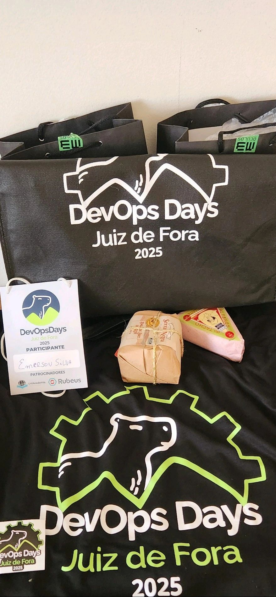

Salve salve pessoal!!!

Tudo bem com vocês? Espero que sim!  

Sair de SP, ir para outro Estado palestrar. Se uns anos atrás alguém me falasse que eu iria fazer um rolê desse, eu daria risada. Mas é o trabalho de formiguinha que faço a tantos anos, me possibilitando ir além. Toda realidade um dia foi sonhada. E aqui estamos. 

Sábado, dia 27/09/2025, estive presente no DevOps Days JF, falando sobre AIOps e K8sGPT. E cara, que experiência incrível foi essa!

## A Primeira Vez Fora de SP para palestrar

Palestrando pela primeira vez fora de São Paulo, confesso que bateu aquele frio na barriga. Não sabia como seria a recepção, se o conteúdo ia ressoar com a galera, se ia conseguir transmitir tudo que eu queria. Mas quando subi no palco e vi aquela galera engajada, interessada, fazendo perguntas, trocando ideias... mano, foi sensacional!

É gratificante poder fazer parte desse evento sensacional que foi o DevOpsDays Juiz de Fora. A excelente recepção, me senti em casa. Gratidão por isso e a toda organização do evento. Gratidão a 4Linux pelo apoio e os demais patrocinadores que fizeram esse evento ser possível. Gratidão a todos os palestrantes, aprendi muita coisa nova e a todos os presentes.

## Agregando para a Comunidade

Foi sensacional participar de um evento dessa dimensão e principalmente por compartilhar com todos um pouco da minha trajetória e poder, quem sabe de alguma forma, contribuir com a comunidade. Poder falar sobre DevOps, OpenSource, AIOps e mostrar na prática como o K8sGPT pode facilitar a vida de quem trabalha com Kubernetes foi muito gratificante.

Ver as pessoas se conectando com o conteúdo, fazendo perguntas, compartilhando suas próprias experiências... isso não tem preço. É pra isso que a gente estuda, se prepara, compartilha conhecimento. Pra agregar, pra somar, pra fazer a comunidade crescer junto.

Eu sou defensor disso, conhecimento deve ser compartilhado. Não adianta guardar pra si, tem que botar pra fora, tem que trocar, tem que construir junto. E eventos como o DevOpsDays são essenciais pra isso acontecer.

Ano que vem estarei presente com certeza!
Simbora

  

