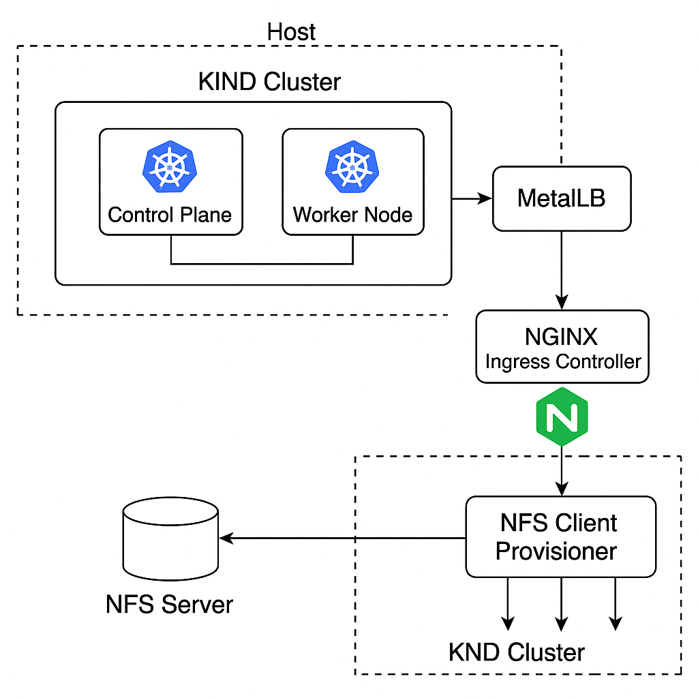

Salve salve pessoal!!!

Tudo bem com vocês? Espero que sim!  

Hoje aqui no blog vou detalhar um pouco a construção de uma Infra Local Kind,NFS,MetalLB e Nginx ingress. 

Bora lá? 


## O que é essa infra? 

Então galera, bem-vindos ao seu playground Kubernetes local, onde o Kind encontra o MetalLB, o NGINX dá as ordens e o NFS guarda tudo com carinho

A ideia é ter um combo de ferramentas distribuída e como pouco uso de recursos computacionais para quem está estudando K8s e também ter uma ambiente local de desenvolvimento bem robusto e prático. Esse é um dos meus labs. 

Com esse combo, você terá:

Um cluster Kubernetes local via KIND 🧱

Um LoadBalancer funcional com MetalLB 📦

Um Ingress Controller top com NGINX 🚦

Um servidor NFS containerizado pronto pro compartilhamento 🔁

E um provisionador automático de PVCs pra facilitar sua vida 📂

Ideal pra devs, SREs, entusiastas de Kubernetes ou qualquer pessoa que só quer ver a mágica acontecer localmente sem depender de nuvem.




Bora colocar esse cluster pra rodar? 

## Clone o reposítório

Realize o clone do repositório abaixo e não se esqueça de me seguir no GitHub também:


`git clone https://github.com/silvemerson/kind-infra-lab.git`

## Crie seu Cluster Kind

Crie seu cluster local com KIND usando o arquivo de configuração customizado cluster.yaml. Este arquivo define a rede e recursos do cluster.

kind create cluster --config cluster.yaml


Se ainda não sabe utilizar o Kind, segue um post bem legal sobre ele [aqui](https://emerson-silva.blog.br/posts/construindo-um-cluster-k8s-kind/)

## Instalando MetalLB

Para quem não conhece, o [MetalLB](https://metallb.io/concepts/) é uma excelente ferramenta para quem não está na nuvem e tem acesso dinâmico a um serviço de LoadBalancer. 

MetalLB permitirá que seu cluster KIND tenha IPs de LoadBalancer, já que KIND não tem isso nativamente.

`kubectl apply -f https://raw.githubusercontent.com/metallb/metallb/v0.14.9/config/manifests/metallb-native.yaml`

Criei um arquivo loadbalancer/metallb-config.yaml no repositório com o seguinte conteúdo, ajustando o range IP para sua rede KIND:

```yml
apiVersion: metallb.io/v1beta1
kind: IPAddressPool
metadata:
  name: kind-pool
  namespace: metallb-system
spec:
  addresses:
  - 172.18.0.240-172.18.0.250  # intervalo seguro fora dos IPs dos nodes
---
apiVersion: metallb.io/v1beta1
kind: L2Advertisement
metadata:
  name: l2
  namespace: metallb-system
```
Altere de acordo com o range de IP do Kind. Consulte com o Docker inspect. Aplique:

`kubectl apply -f loadbalancer/metallb-config.yaml`


## Nginx Ingress

Crie o namespace dedicado e instale o ingress NGINX, expondo o serviço como LoadBalancer para receber tráfego externo:

```bash
kubectl create namespace ingress-nginx
helm repo add ingress-nginx https://kubernetes.github.io/ingress-nginx
helm repo update
helm install ingress-nginx ingress-nginx/ingress-nginx \
  --namespace ingress-nginx \
  --set controller.service.type=LoadBalancer

```

## NFS

Use o arquivo nfs-server-compose.yaml para criar um container Docker com servidor NFS, que será usado para armazenamento compartilhado.

Inicie o container:

`docker compose -f nfs/nfs-server-compose.yaml up -d`

Após criar o NFS, verifique qual IP ele recebeu ao ser criado, em seguida, execute a instação do client no Kind:

```bash
helm repo add nfs https://kubernetes-sigs.github.io/nfs-subdir-external-provisioner
helm repo update
kubectl create ns nfs-provisioner
helm upgrade --install nfs-provisioner nfs/nfs-subdir-external-provisioner \
    --namespace nfs-provisioner \
    --set nfs.server=172.18.0.5 \
    --set nfs.path="/" \
    --set storageClass.name=nfs-client \
    --set storageClass.defaultClass=true
```

## Testando integração

Crie um namespace de teste e aplique um PVC para validar se o provisionador está funcionando:

```bash
kubectl create ns test-nfs
kubectl apply -f nfs/pvc-nfs-test.yaml
kubectl get pvc -n test-nfs
```
Resultado:

```bash
NAME           STATUS   VOLUME                                     CAPACITY   ACCESS MODES   STORAGECLASS   AGE
nfs-test-pvc   Bound    pvc-ceca3596-4409-421c-89c7-a504fd1cb44d   1Gi        RWX            nfs-client     13s

```
## Conclusão

E assim teremos uma infra pronta para uso localmente e leve pessoal. Faça o fork e melhorem essa infra!!! 

até a próxima 

TMJ


## Referências

https://github.com/silvemerson/kind-infra-lab#

https://metallb.io/installation/

https://emerson-silva.blog.br/posts/construindo-um-cluster-k8s-kind/

<div id="giscus-comments">
  <script src="https://giscus.app/client.js"
          data-repo="silvemerson/emerson-silva-blog"
          data-repo-id="R_kgDONTalJA"
          data-category="General"
          data-category-id="DIC_kwDONTalJM4CkhmM"
          data-mapping="pathname"
          data-strict="0"
          data-reactions-enabled="1"
          data-emit-metadata="1"
          data-input-position="top"
          data-theme="dark"
          data-lang="pt"
          data-loading="lazy"
          crossorigin="anonymous"
          async>
  </script>
</div>