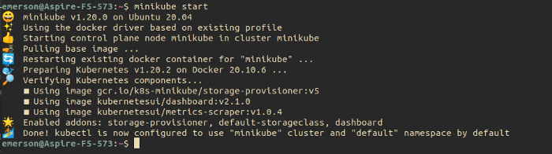
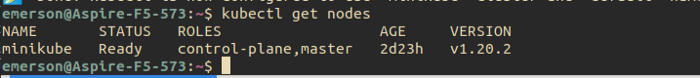
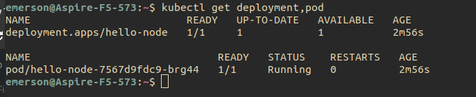
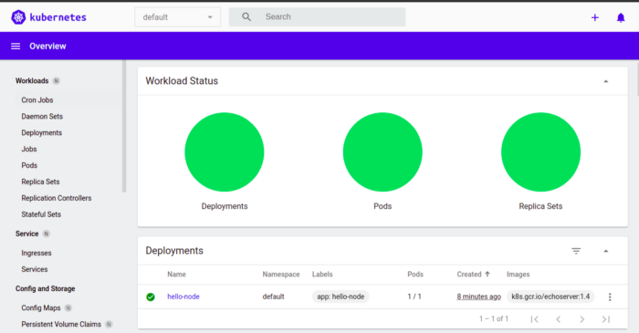

Olá pessoal

Hoje vou demonstrar como baixar, instalar e configurar o Minikube. Nesse passo a passo vou exemplificar como fazer isso no Linux.


Primeiro, vamos entender o que é exatamente o Minikube.


O Minikube configura rapidamente um cluster local do Kubernetes no macOS, Linux e Windows. Ele é totalmente gratuito e fácil de instalar. Ele cria uma VM com nó unico para que você possa fazer seus testes no K8s. Para mais informações sobre ele acesso aqui a [documentação](https://minikube.sigs.k8s.io/docs/).
 
Sem mais delongas, vamos configurar nosso cluster. Let’s go!!
Antes de instalar o Minikube, precisamos realizar a instalação do kubectl:


```$ curl -LO https://storage.googleapis.com/kubernetes-release/release/$(curl -s https://storage.googleapis.com/kubernetes-release/release/stable.txt)/bin/linux/amd64/kubectl```


Feito isso, execute:


```$ chmod +x kubectl && mv kubectl /usr/local/bin/```


Pronto, o kubectl está instalado. Para confirmar que ele de fato está configurado, cheque a versão dele com:


```$ kubectl version```

O comando acima irá trazer a versão do kubectl instalada.
Próximo passo é instalar o Minikube. Para isso execute no seu terminal:

``` $  curl -Lo minikube https://storage.googleapis.com/minikube/releases/latest/minikube-linux-amd64 \ && chmod +x minikube ```

Posteriormente:

``` $ sudo cp minikube /usr/local/bin && rm minikube```

Agora vamos iniciar nosso cluster com o comando minikube start:



Feito, nosso cluster está instalado e em execução localmente. Vamos consultar os nodes criados:



Por default ele criou um node para que possamos fazer nossos testes. Que tal criarmos nosso primeiro deployment? Execute o comando abaixo em seu terminal:

``` $ kubectl create deployment hello-node --image=k8s.gcr.io/echoserver:1.4 ```


Nosso primeiro deployment foi criado. Vamos consultar os recursos que foram criados:




Feito! Nosso cluster está em execução e com uma aplicação provisionada.


Outro recurso interessante que o Minikube oferece é um painel web com a saúde e recursos do cluster. Para visualiza-lo execute:


```$ minikube dashboard```

Ele vai gerar um link do painel do cluster, acesse em seu navegador:





Veja, nosso deployment está sendo exibido no painel!!

Mais alguns comandos para vocês testarem:


**minikube ip**: exibe o IP do Cluster


**minikube ssh**: acessa o cluester por SSH


**minikube logs**: visualiza os logs do cluster


Por hoje é só pessoal, o Minikube é uma ótima ferramenta para testar o Kubernetes e brincar com orquestração de containers.


https://kubernetes.io/pt-br/docs/tutorials/hello-minikube/

https://minikube.sigs.k8s.io/docs/