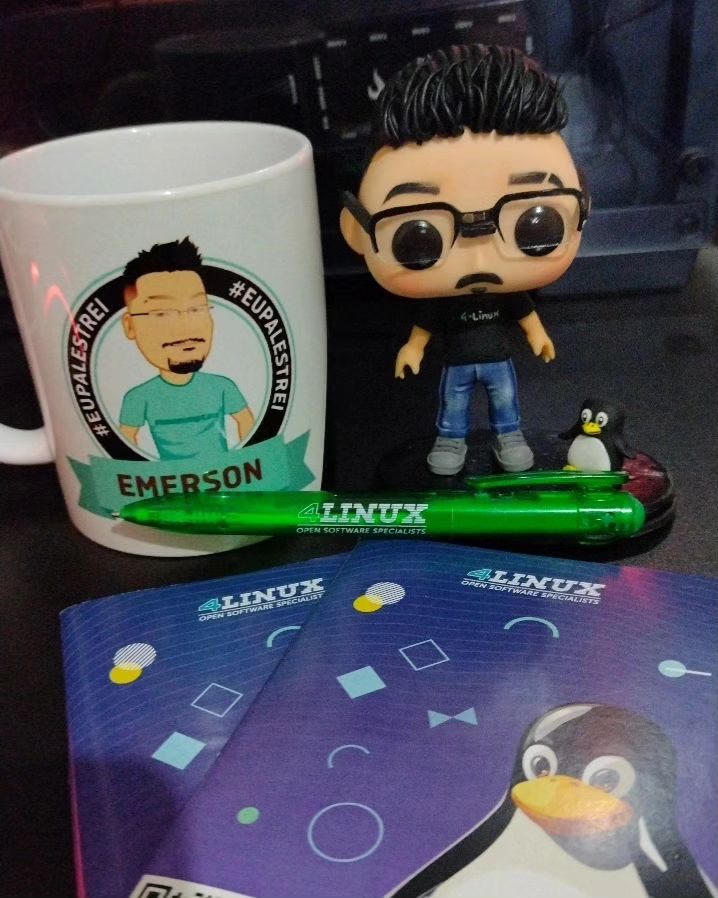

Olá pessoal, tudo certo? 

Ontem estive ministrando uma palestra sobre como realizar um deploy no Kuberntes usando o Gitlab-CI no canal da [4Linux](https://www.youtube.com/@4linux). Quem não pode conferir ao vivo, confere lá: 

## Repositório do GiLab

[4linux-palestra-kubernetes-days](https://gitlab.com/silvemerson/4linux-palestra-kubernetes-days)

## Live está gravada no Youtube 



## Brinde do palestrante

Ganhei um Funko personalizado e uma caneca sensacional. 

  

