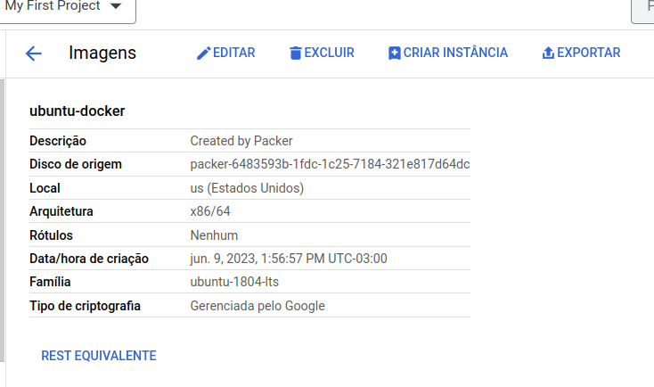

Olá pessoal, tudo bem?

Espero que sim! 

No post do blog de hoje, vamos falar dessa ferramenta sensacional que é o Packer da HashiCorp. Bora lá.

## O que é o Packer

O Packer é uma ferramenta de automação de criação de imagens desenvolvida pela HashiCorp. Ele permite criar imagens de máquinas virtuais ou contêineres automatizadamente, garantindo a criação de imagens consistentes e prontas para serem implantadas em diferentes plataformas.

Com o Packer, você pode definir as configurações da imagem em um arquivo de configuração declarativo, especificando o sistema operacional, as dependências, as configurações do aplicativo e outras personalizações desejadas. Em seguida, o Packer cria a imagem executando esse arquivo de configuração, provisionando e configurando uma instância temporária da máquina virtual ou do contêiner e, em seguida, capturando essa instância em uma imagem final.

O Packer suporta várias plataformas de virtualização, como Amazon Web Services (AWS), Microsoft Azure, Google Cloud Platform (GCP), VMware, Docker e outros. Ele também é extensível e permite que você crie seus próprios plugins para suportar plataformas adicionais.

## Instalação


Linux
Ubuntu/Debian:

Adicione a GPG Key da HashiCorp:

```curl -fsSL https://apt.releases.hashicorp.com/gpg | sudo apt-key add - ```

Adicione o repositório oficial HashiCorp Linux:

``` `sudo apt-add-repository "deb [arch=amd64] https://apt.releases.hashicorp.com $(lsb_release -cs) main" ```

Atualize o repositório e faça a instalação:

```sudo apt-get update && sudo apt-get install packer```

Validando instalação*

```
packer
Usage: packer [--version] [--help] <command> [<args>]

Available commands are:
    build           build image(s) from template
    console         creates a console for testing variable interpolation
    fix             fixes templates from old versions of packer
    fmt             Rewrites HCL2 config files to canonical format
    hcl2_upgrade    transform a JSON template into an HCL2 configuration
    init            Install missing plugins or upgrade plugins
    inspect         see components of a template
    validate        check that a template is valid
    version         Prints the Packer version
```

## Criando imagem personalizada

Vamos criar a nossa imagem personalizada com o Docker já instalado nela. Para isso, primeiro vamos criar um arquivo chamado docker.sh da seguinte forma:

**docker.sh**

```bash
sudo apt-get update -y
curl -fsSL https://download.docker.com/linux/ubuntu/gpg | sudo gpg --dearmor -o /usr/share/keyrings/docker-archive-keyring.gpg
echo \
  "deb [arch=amd64 signed-by=/usr/share/keyrings/docker-archive-keyring.gpg] https://download.docker.com/linux/ubuntu \
  $(lsb_release -cs) stable" | sudo tee /etc/apt/sources.list.d/docker.list > /dev/null
sudo apt-get update -y
sudo apt-get install docker-ce docker-ce-cli containerd.io -y
```

Posteriormente, vamos criar nosso arquivo Packer com o seguinte conteúdo e no formato JSON.

**ubuntu-docker.json**

```json
{
  "builders": [
    {
      "type": "googlecompute",
      "project_id": "seu-id-do-projeto",
      "source_image_family": "ubuntu-1804-lts",
      "zone": "us-central1-a",
      "ssh_username": "emerson",
      "image_name": "ubuntu-docker",
      "image_family": "ubuntu-1804-lts",
      "disk_size": "10",
      "tags": ["docker"],
      "metadata": {
        "4labs": "dev"
      }
    }
  ],

"provisioners": [
        {
  "type": "shell",
  "script": "docker.sh"
        }
]    

}
```

Para entender melhor o nosso arquivo do Packer:

**type**: tipo de builder, no caso vamos suar a GCP.

**project_id**: Id do projeto na GCP.

**source_image_family**: versão do S.O escolhido como imagem base.

**zone**: Região da imagem

**ssh_username**: Usuário que vai ser criado.

**image_name**: nome da imagem personalizada que será criada.

**image_family**: Label para definir se a imagem é do Debian, Ubuntu, RHEL, etc.

**disk_size**: Tamanho do disco da imagem.

Por fim temos os parametros referente ao provisioners:

**type**: Tipo de de provisionamento, por exemplo, ShellScript script: Nome do Script

## Construindo nossa imagem

Após criação do nosso arquivo Packer e o Script para inicializar o Docker nessa imagem personalizada, vamos validar nossas configurações com o seguinte comando:

```
$ packer validate ubuntu-docker.json 
The configuration is valid.
```
Pronto. Bora fazer o nosso deploy. Antes, faça o login na GCP e ative as APIs abaixo em sequência:

```
gcloud auth application-default login

gcloud services enable sourcerepo.googleapis.com

gcloud services enable compute.googleapis.com

gcloud services enable servicemanagement.googleapis.com

gcloud services enable storage-api.googleapis.com

gcloud services enable compute


```
Build da nossa imagem:

packer build ubuntu-docker.json

Output:

```
googlecompute: output will be in this color.

==> googlecompute: Checking image does not exist...
==> googlecompute: Creating temporary RSA SSH key for instance...
==> googlecompute: Using image: ubuntu-1804-bionic-v20230605
==> googlecompute: Creating instance...
    googlecompute: Loading zone: us-central1-a
    googlecompute: Loading machine type: n1-standard-1
    googlecompute: Requesting instance creation...
    googlecompute: Waiting for creation operation to complete...
    googlecompute: Instance has been created!
==> googlecompute: Waiting for the instance to become running...
    googlecompute: IP: 34.172.43.120
==> googlecompute: Using SSH communicator to connect: 34.172.43.120
==> googlecompute: Waiting for SSH to become available...
==> googlecompute: Connected to SSH!
==> googlecompute: Provisioning with shell script: docker.sh
```
Nesse processo de Build, o Packer vai criar uma Instância na GCP e criar a nossa imagem personalizada com o script que criamos.

Se acessarmos https://console.cloud.google.com/compute/images?tab=images&authuser=4&hl=pt-br&project=ID_do_PROJETO vamos visualizar nossa imagem criada(Insira o ID do seu projeto no final da URL).



Por hoje é só pessoal! E assim conseguimos criar uma imagem personalizada para a GCP usando o Packer. Em breve volto com mais possibilidades com ele. Não esqueça de compartilhar esse artigo em suas redes sociais.

Até breve.

## Referências

https://www.packer.io/

https://www.packer.io/use-cases/automated-machine-images

https://developer.hashicorp.com/packer/tutorials/docker-get-started/get-started-install-cli

https://cloud.google.com/build/docs/building/build-vm-images-with-packer?hl=pt-br

<div id="giscus-comments">
  <script src="https://giscus.app/client.js"
          data-repo="silvemerson/emerson-silva-blog"
          data-repo-id="R_kgDONTalJA"
          data-category="General"
          data-category-id="DIC_kwDONTalJM4CkhmM"
          data-mapping="pathname"
          data-strict="0"
          data-reactions-enabled="1"
          data-emit-metadata="1"
          data-input-position="top"
          data-theme="dark"
          data-lang="pt"
          data-loading="lazy"
          crossorigin="anonymous"
          async>
  </script>
</div>