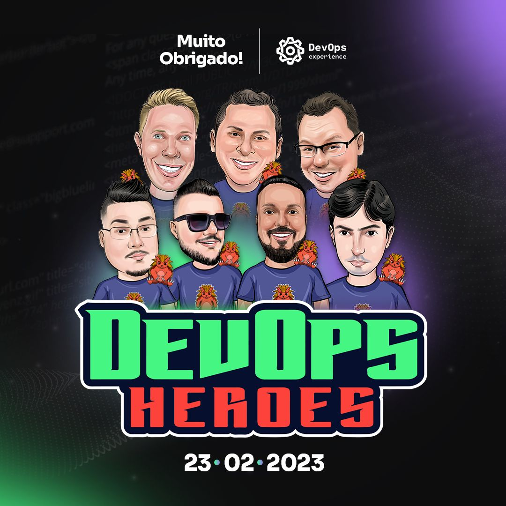

Olá pessoal! 

No post de hoje do blog, vou comentar um pouco como foi a minha experiência palestrando no DevOps Experience

Bora lá

## Sobre o que foi a palestra? 

Fui convidado pelo DevOps Heroes para palestrar para comunidade, no evento mensal chamado DevOps Experience. O tema era livre e com 50 minutos de apresentação além do Kahoot, que é um gameshow de perguntas sobre a palestra. 
A proposta do evento, é de várias palestras durante o dia todo, com temas variados sobre DevOps. 

Decide falar sobre Kubernetes, pra variar. Nem gosto haha 

Então projetei um Hand On na GCP, provisionando o GKE, que é o serviço de Kubernetes da Google Cloud e usando alguns serviços da nuvem, como GCR, que trata-se do Registry de imagens de contêineres e o Filestore, um compartilhamento de arquivos via rede. 

## Como foi a preparação e experiência?

Como mencionei sobre o que foi a palestra, criei um repositório e registrei todo o roteiro do que seria feito na apresentação e segui meu jeito de passar o conteúdo. Pelo tempo curto, tentei passar os principais tópicos do Kubernetes para que ficasse claro os passos no lab, então falei sobre arquitetura e o que são objetos em Kubernetes. 
Apresentei como fazer um deploy, usando NodePort e LoadBalancer, pelos comentários na Live, gostaram da dinâmica. Meu tempo acabou e não consegui concluir o deploy final. 

Sobre minha experiência, foi fantástica, fui o segundo a palestrar. Por ter vivência na sala de aula e já ter feito uma Live com a proposta parecida, foi bem tranquilo. 

Eu particularmente gostei da dinâmica de divulgação, nas redes sociais, com foto os palestrantes, experiência na área. A caricatura dos palestrantes foi bem legal também. Vou deixar no final do post. E a comunicação com o Daniel, Host do DevOps Heoress foi bem fluída, quero estar presente nos próximos eventos voltado para a comunidade. 

A Live da palestra foi gravada e disponibilizada no Youtube, o link irei deixar no final do post. 

Quero participar de mais eventos assim e propagar a cultura DevOps e conhecimento com a comunidade. 

## Live está gravada no Youtube 



  

