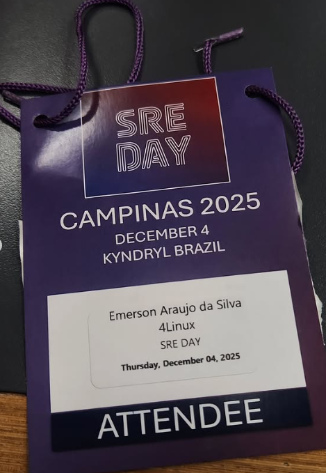

Salve salve pessoal!!!

Tudo bem com vocês? Espero que sim!  

Fazer parte da história do primeiro SREDay da América Latina foi algo surreal! Quando recebi o convite pra palestrar em Campinas, nem acreditei. Um evento inédito, marcando a primeira edição focada em SRE na América Latina, e eu ali, fazendo parte disso. Que privilégio!

O evento aconteceu no dia 04 de Dezembro de 2025 na Kyndryl, com apoio da DOUGBR - DevOps User Group Brazil. Muito conteúdo sensacional!

## Primeiro SREDay da América Latina

Foi sensacional a experiência de palestrar no primeiro SREDay da América Latina! A energia do evento foi única. Ver a comunidade SRE se reunindo, trocando experiências, compartilhando desafios e soluções... cara, isso é o que faz a diferença!

Toda a organização está de parabéns pelo evento, foi incrível! Desde a recepção até a estrutura, tudo muito bem pensado e executado. Deu pra ver o carinho e dedicação que foi colocado em cada detalhe.

## Minha Palestra: Além do Deploy no Kubernetes

Nesta apresentação, fui além do Deploy no Kubernetes e falei sobre AIOps, Green Software, Ollama e LLMs Open Source. Trouxe para vocês o que realmente faz sentido aplicar e o que não funciona tão bem assim, tudo baseado na minha experiência prática integrando essas ferramentas no meu trabalho como administrador de Kubernetes.

Se quiser conferir a palestra completa, está disponível aqui: [https://www.youtube.com/watch?v=J1q-G7-A5Ug](https://www.youtube.com/watch?v=J1q-G7-A5Ug)

E olha só, recebi minha credencial de Speaker do evento! Você pode conferir aqui: [https://credsverse.com/credentials/6ac326e5-2240-4f10-a962-f31f98dd1304](https://credsverse.com/credentials/6ac326e5-2240-4f10-a962-f31f98dd1304)

## A Comunidade SRE Crescendo

Meu parabéns também aos palestrantes que trouxeram temas espetaculares para compartilhar com a comunidade! Aprendi muito com cada apresentação, cada case, cada experiência compartilhada. É isso que fortalece a comunidade: a troca, o compartilhamento, a vontade de crescer junto.

Poder contribuir com esse evento histórico, falar sobre observabilidade, SRE e boas práticas foi uma honra. Ver as pessoas engajadas, fazendo perguntas, compartilhando suas realidades... isso não tem preço.

Gratidão a todos os envolvidos, patrocinadores e principalmente à galera que compareceu e fez esse evento ser um sucesso!

Bora que bora, pra cima!

  

