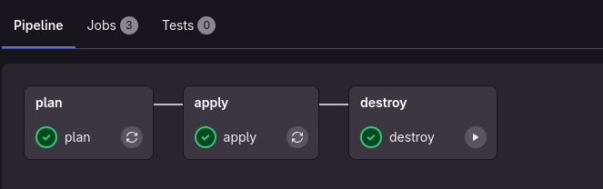

Salve salve pessoal!!!

Tudo bem com vocês? Espero que sim!  

Hoje no nosso blog vamos seguier com a sequência de post voltado a CI/CD. Vamos falar de como criar uma pipeline para criar um EC2 na AWS usando o Gitlab CI e armazenando o tf state no prórprio GitLab. Bora lá?

## O que é o Terraform

O Terraform é uma ferramenta open-source desenvolvida pela HashiCorp que permite o gerenciamento de infraestrutura como código (Infrastructure as Code - IaC). Com o Terraform, você pode definir, provisionar e gerenciar recursos de infraestrutura em diversos provedores (como AWS, Azure, Google Cloud, entre outros) de maneira declarativa.

### Por que usar o Terraform?

**Portabilidade**: Suporte a múltiplos provedores, como AWS, Azure, GCP, Kubernetes, etc.

**Controle de versões**: Como o código está em arquivos .tf, é fácil versionar a infraestrutura com Git.

**Infraestrutura declarativa**: Você descreve o estado desejado, e o Terraform faz o resto.

**Execução planejada**: Antes de aplicar mudanças, o Terraform gera um plano (terraform plan), mostrando o impacto das alterações.

### Fluxo de Trabalho do Terraform

**Escrever código**: Escreva arquivos de configuração .tf que definem os recursos.

**Inicializar**: Prepare o ambiente com o comando terraform init.

**Validar**: Verifique se a configuração está correta com terraform validate.

**Planejar**: Veja o que será criado, alterado ou destruído com terraform plan.

**Aplicar**: Aplique as mudanças para provisionar recursos com terraform apply.

## Criando manifestos do Terraform

Primeiro, crie um arquivo chamado ```backend.tf```

```hcl

terraform {
  backend "http" {
    
  }
}
```
Segundo, crie outro arquivo chamado ```ec2.tf```

```hcl
resource "aws_instance" "gitlab-ci-example-pipeline" {
  ami           = "ami-01b7be8d0c978c77c"
  instance_type = "t2.micro"
  tags = {
    Name = "gitlab-ci-example-pipeline"
  }
}
```

Por fim, crie um arquivo chamado ```provider.tf```:


```hcl

provider "aws" {
  region = "us-east-1"
}

```
### Criando Pipeline

Os pontos de atenção nessa nossa pipeline é as variáveis, elas são definidas no próprio GitLab, no menu de Settings -> CI/CD -> Variables


**GITLAB_CI_TOKEN**: Token do GitLab.

**AWS_SECRET_ACCESS_KEY**: Secret para autenticação na AWS. 

**AWS_ACCESS_KEY_ID**: KEY para autenticação na AWS.

**AWS_DEFAULT_REGION**: Região da AWS. 

Crie um arquivo chamado `.gitlab-ci.yml` e inicie primeiro definindo a imagem que vamos utilizar para exeuctar essa pipeline:

```yml
image:
  name: hashicorp/terraform:light
  entrypoint: ["/usr/bin/env"]
```
Após isso, vamos definir os stages:

```yml
stages:
  - plan
  - apply
  - destroy
```

**plan**: Para planejar nossa infra.

**apply**: Para Criar a nossa infra.

**destroy**: Para destruir nossa infra.


Agora, bora definir as váriaveis:

```yml
variables:
  GITLAB_CI_TOKEN: "${GITLAB_CI_TOKEN}" 
  AWS_SECRET_ACCESS_KEY: "${AWS_SECRET_ACCESS_KEY}"
  AWS_ACCESS_KEY_ID: "${AWS_ACCESS_KEY_ID}"
  TF_ADDRESS: "https://gitlab.com/api/v4/projects/ID_PROJETO/terraform/state/state-name"
  TF_USERNAME: "SEU USER"
  TF_PASSWORD: "${GITLAB_CI_TOKEN}" 

```
Preencha com a informações do seu repositório e token. 

Finalize a pipeline com os stages que definimos, além de configurar um `before_script` para executar sempre antes dos stages para carregar o tfstate:

```yml
before_script:
  - terraform init -backend-config="address=$TF_ADDRESS" -backend-config="lock_address=$TF_ADDRESS/lock" -backend-config="unlock_address=$TF_ADDRESS/lock" -backend-config="username=$TF_USERNAME" -backend-config="password=$TF_PASSWORD" -backend-config="lock_method=POST" -backend-config="unlock_method=DELETE" -backend-config="retry_wait_min=5"
    
plan:
  stage: plan
  script:
    - terraform plan -out=tfplan -input=false -lock=false

apply:
  stage: apply
  script:
    - terraform apply -input=false -lock=false -auto-approve

destroy:
  stage: destroy
  when: manual
  script:
    - terraform destroy -input=false -lock=false -auto-approve
```


## Executando Job

Job em execução:




Pronto! Veja que definimos somente o Destroy como manual, então após a criação vocẽ pode executar para remover a infra. 

## TF STATE no GitLab

Vá em Operate -> Terraform State e visualize o state criado:


Tivemos sucesso. Até a proxima pessoal! 

Até a próxima.

## REFERÊNCIAS

https://docs.gitlab.com/ee/user/infrastructure/iac/terraform_state.html

<div id="giscus-comments">
  <script src="https://giscus.app/client.js"
          data-repo="silvemerson/emerson-silva-blog"
          data-repo-id="R_kgDONTalJA"
          data-category="General"
          data-category-id="DIC_kwDONTalJM4CkhmM"
          data-mapping="pathname"
          data-strict="0"
          data-reactions-enabled="1"
          data-emit-metadata="1"
          data-input-position="top"
          data-theme="dark"
          data-lang="pt"
          data-loading="lazy"
          crossorigin="anonymous"
          async>
  </script>
</div>